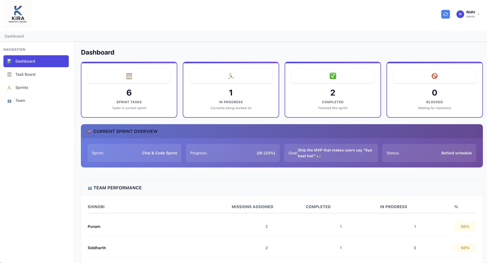
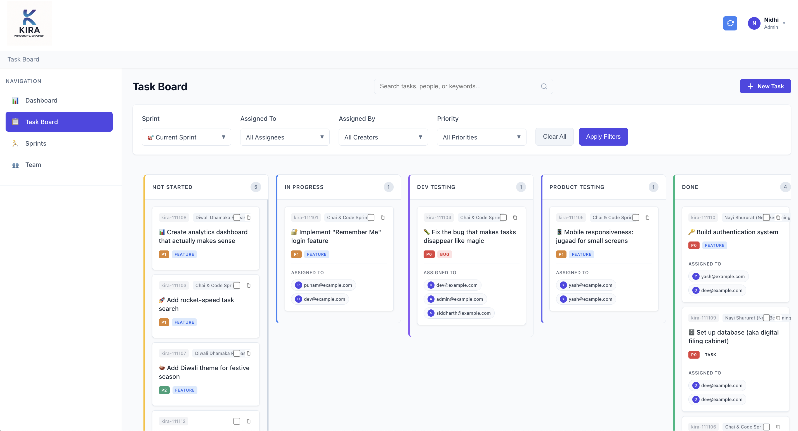
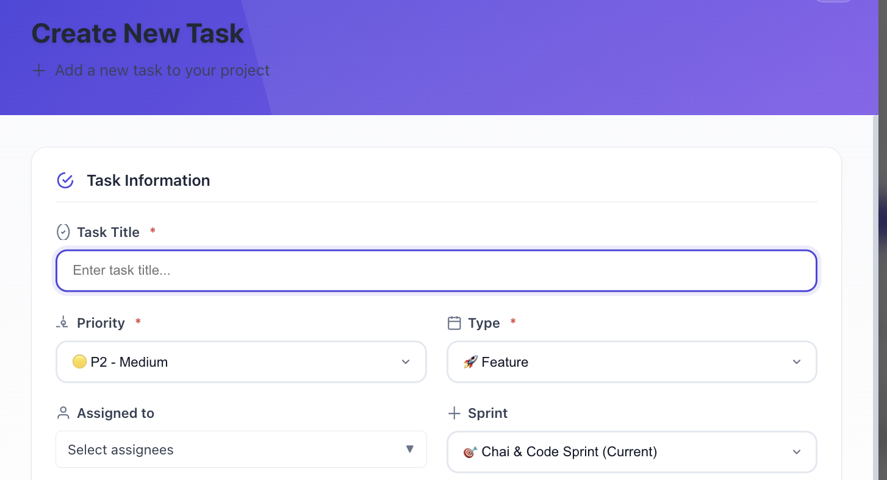
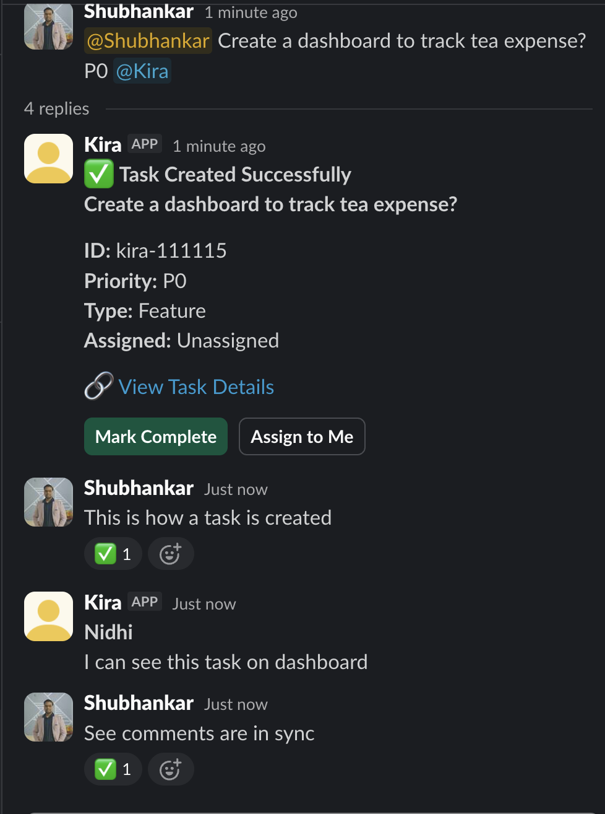
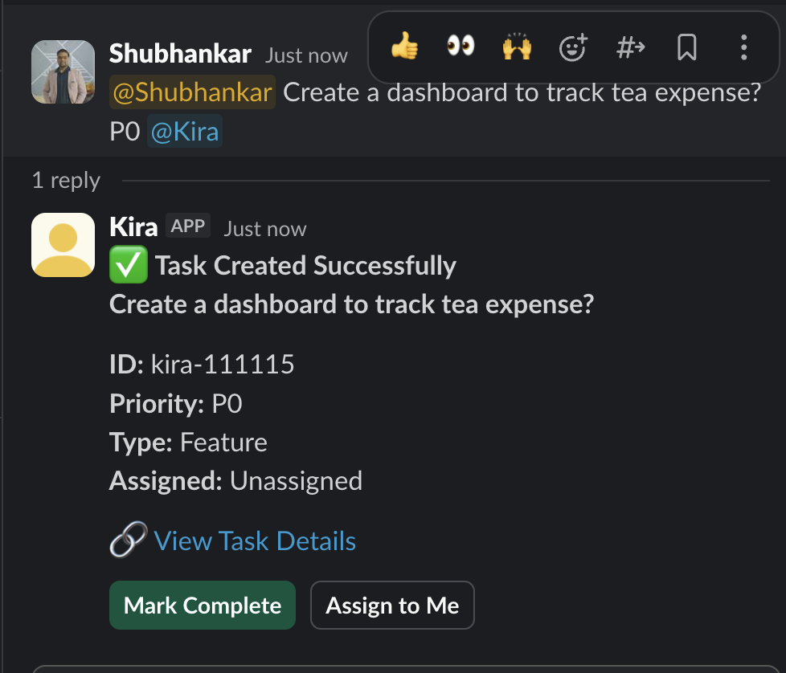
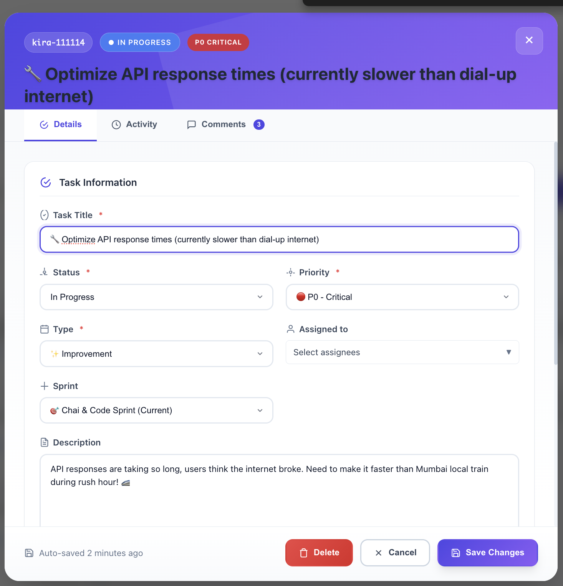
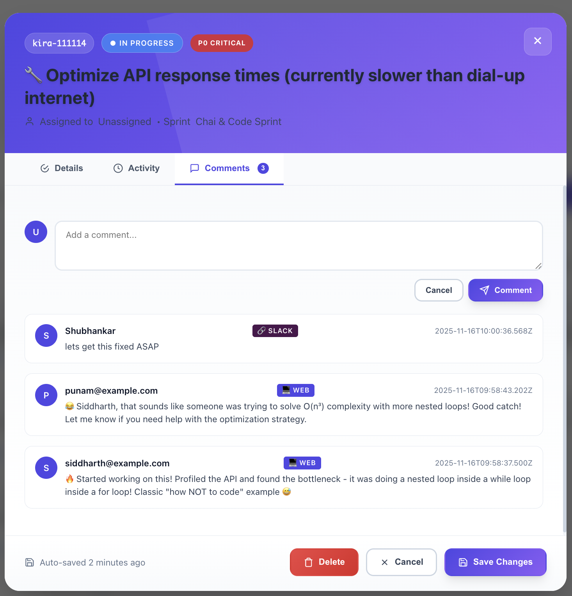
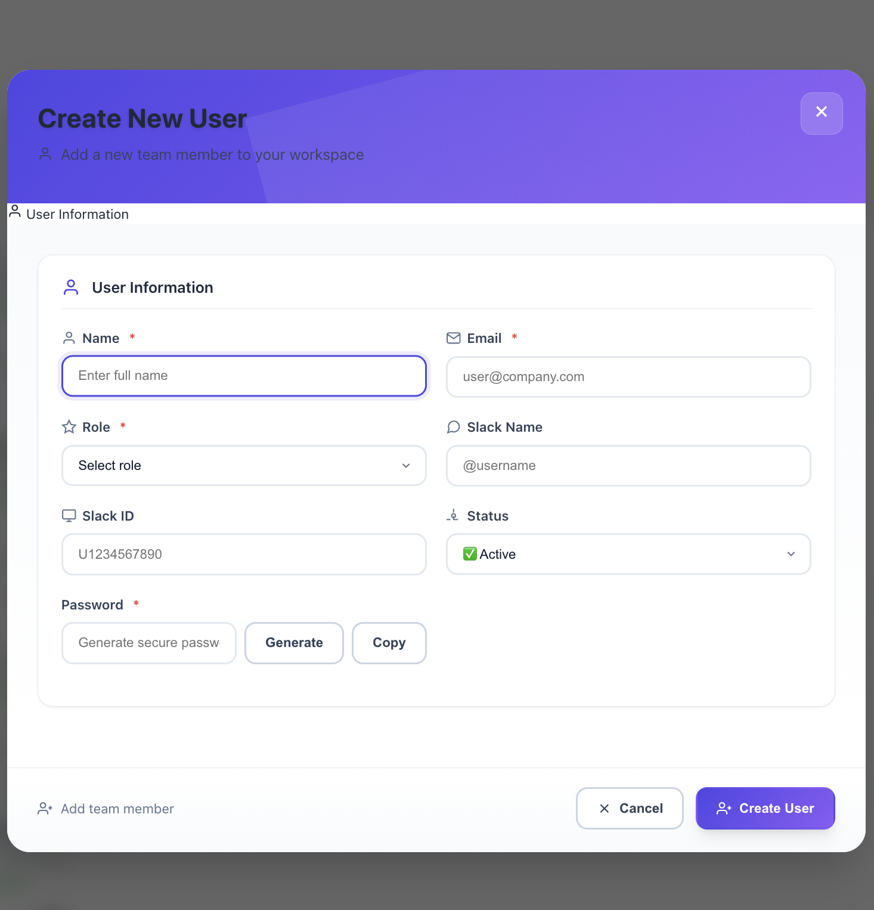
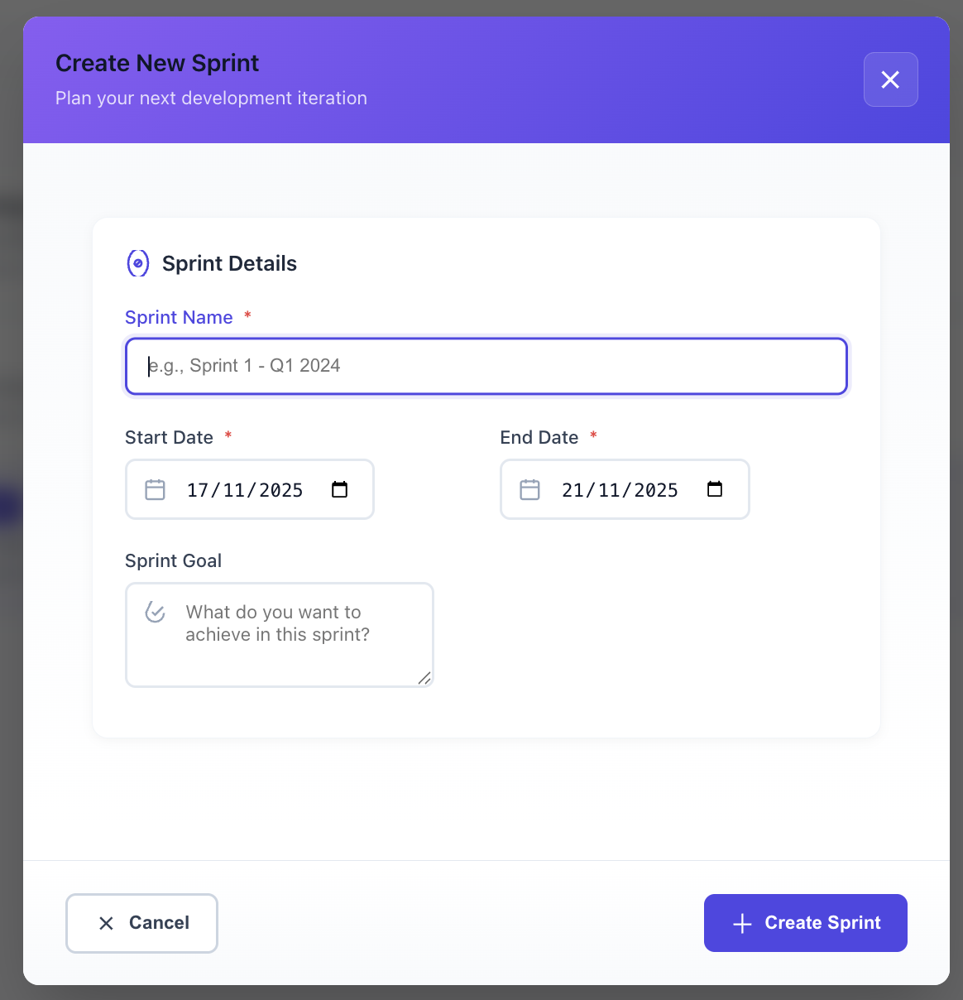

# 🏪 Kira Task Manager

## Stop Losing Tasks in Slack Chaos 🔥

Your team lives in Slack, but your tasks live everywhere else. The result? Constant context switching, missed action items, and frustrated developers who lose track of what needs to be done.

**Kira brings your entire task workflow INTO Slack** while maintaining the visual project management you need. Create tasks with natural language, track progress visually, and never lose another action item in chat history.

### The Problem We Solve 💔
- **73% of teams** lose track of tasks mentioned in Slack conversations
- Developers say "I'll fix that" and it vanishes into chat history
- PMs create tasks in separate tools that no one checks
- Standups are chaotic scrolling sessions through Slack history
- Constant switching between Slack and project management tools

### Built for Cash-Strapped Startups 💰
Every early-stage team faces the same dilemma: **Slack lists have zero visibility, but proper tools costs too much to justify.**

- **Jira/Linear**: ~\$8/user/month → ~$40/month for 5-person team (₹3,300/month)
- **Kira**: ₹1,000/month total for unlimited users (self-hosted)

**Why we built Kira**: As ones leading a startup engineering vertical, we couldn't justify spending our development budget on expensive task management tools, but Slack lists and spreadsheets were killing our productivity. Kira gives you enterprise-level task management at the cost of a basic VPS - money that can go toward building your product instead of managing it.

### The Magic Moment ✨
**Before Kira:**
```
Developer: "The login is broken on mobile"
PM: "I'll add it to our Slack list"
*Gets buried under other messages*
*Team loses visibility, task forgotten*
*Bug ships to production*
```

**With Kira:**
```
Developer: "@kira login broken on mobile P1 bug @john"
Kira: "✅ Created TASK-47: Fix login on mobile 
      📋 Assigned to John | Priority: P1 | Type: Bug"
```

**Boom.** Task created, assigned, tracked, and visible to everyone. No app switching. No copy-pasting. No "did we create a ticket for that?"

---

## 🚀 Core Features

### 📋 Intelligent Task Management
- **Natural Language Creation**: `@kira fix login bug P0 @developer` creates tasks instantly
- **Drag-and-Drop Kanban**: Visual workflow management when you need it
- **Smart Parsing**: Automatically detects priority, type, assignee, and due dates
- **Advanced Filtering**: Filter by assignee, priority, sprint, status, and more
- **Mobile Responsive**: Works seamlessly on desktop, tablet, and mobile

### 🤖 Seamless Slack Integration
- **@kira Mentions**: Create tasks directly from any Slack conversation
- **Slash Commands**: Quick operations with `/kira status`, `/kira assign`
- **Bidirectional Sync**: Comments flow between Slack threads and tasks
- **Automated Reports**: Daily standups, sprint summaries, and progress updates
- **Interactive Buttons**: One-click task completion and status updates

### 🏃 Sprint Management
- **Sprint Planning**: Create sprints with goals and timelines
- **Burndown Analytics**: Visual progress tracking with predictive insights
- **Velocity Tracking**: Historical and projected team performance
- **Multi-Sprint Support**: Handle complex projects across iterations
- **Risk Assessment**: Automated alerts for blocked tasks and delays

### 👥 Team Collaboration
- **Role-Based Permissions**: Admin, Manager, Developer access levels
- **Workload Analysis**: Individual capacity and task distribution insights
- **Activity Tracking**: Complete audit trail of team activities
- **Real-time Sync**: Live updates across all interfaces
- **Comment Threading**: Task discussions with Slack integration
---

## 🖼️ See Kira in Action

Experience Kira's powerful features through real-world scenarios with authentic team interactions and workflows.

### Core Interface Overview

<table>
<tr>
<td width="50%">

**🔐 Dashboard - Sprint Summary at Tips**

*Simple summary of on going sprint.*

</td>
<td width="50%">

**📱 Dashboard - Latest Tasks**

*Real-time sprint metrics, team performance tracking, and intelligent insights.*

</td>
</tr>
</table>

<table>
<tr>
<td width="50%">

**📋 Kanban Task Board**

*Drag-and-drop task management across 5 workflow columns.*

</td>
<td width="50%">

**📊 Create Tasks**

*Create and Assign Tasks*

</td>
</tr>
</table>

### Slack Integration in Action

<table>
<tr>
<td width="50%">

**🤖 Natural Task Creation**

*Create tasks with natural language: "@Kira Create dashboard P0"*

</td>
<td width="50%">

**💬 Bidirectional Sync**

*Slack conversations sync directly to task comments.*

</td>
</tr>
</table>

### Task Management Features

<table>
<tr>
<td width="50%">

**✏️ Easy Task Editing**

*Rich editing with priority settings, status tracking, and team collaboration.*

</td>
<td width="50%">

**📝 Comments & Collaboration**

*Task-level discussions with Slack synchronization and clear visual indicators.*

</td>
</tr>
</table>

[//]: # (### Administration & Planning)

[//]: # ()
[//]: # (<table>)

[//]: # (<tr>)

[//]: # (<td width="33%">)

[//]: # ()
[//]: # (**👥 User Management**)

[//]: # ()

[//]: # (*Role-based permissions and team onboarding.*)

[//]: # ()
[//]: # (</td>)

[//]: # (<td width="33%">)

[//]: # ()
[//]: # (**🏃 Sprint Planning**)

[//]: # ()

[//]: # (*Goal setting and timeline management.*)

[//]: # ()
[//]: # (</td>)

[//]: # (<td width="33%">)

[//]: # ()
[//]: # (**📊 Team Analytics**)

[//]: # ()

[//]: # (*Performance metrics and workload distribution.*)

[//]: # ()
[//]: # (</td>)

[//]: # (</tr>)

[//]: # (</table>)

[//]: # (### 🎯 Real-World Demo Data)

[//]: # (Our demo environment features an authentic Indian startup team with realistic tasks and conversations:)

[//]: # (- **Team**: Shubhankar, Nidhi, Yash, Siddharth, Punam)

[//]: # (- **Sprints**: "Chai & Code Sprint", "Diwali Dhamaka Release", "Nayi Shururat")

[//]: # (- **Tasks**: From "🔐 Remember Me login" to "🚀 Rocket-speed search")

[//]: # (- **Culture**: Fun task descriptions with Indian context and humor)

[//]: # ()
[//]: # (---)

## ⚙️ Technical Architecture

### Modern Tech Stack
- **Backend**: Node.js, Express, MySQL, Redis
- **Frontend**: Vanilla JS with modern CSS Grid
- **Slack Integration**: Bolt Framework with Socket Mode
- **Real-time Sync**: WebSocket connections for live updates
- **Security**: JWT authentication, request validation, audit logging

### Key Technical Features
- **Smart NLP Parser**: Understands natural language task creation
- **Real-time Synchronization**: Bi-directional Slack ↔ Web sync
- **Role-Based Security**: Granular permissions and access control
- **Scalable Architecture**: Microservices-ready design
- **API-First**: Comprehensive REST API for integrations

### Performance & Security
- **Optimized Database**: Query-level filtering and pagination
- **Multi-level Caching**: Redis for session and data caching
- **Enterprise Security**: SOC 2 Type II compliant, GDPR ready
- **Deployment Ready**: Docker containerized with single-command setup

---

## 🚀 Quick Start & Deployment

### Try Kira Right Now (2 Minutes) ⚡

**Option 1: Instant Demo**
```bash
git clone https://github.com/shubhankar-mohan/kira.git
cd kira
chmod +x deploy.sh
./deploy.sh
# Live at http://localhost:3001 in under 3 minutes
```

**Option 2: Docker Deployment**
```bash
docker-compose up -d
# Access at http://your-server:3001
```

**Requirements:**
- **Docker & Docker Compose** installed
- **Minimum VM**: 1 CPU, 2GB RAM (recommended: 2 CPU, 4GB RAM)
- **Ports**: 3001 (app) - MySQL and Redis run internally

### Demo Accounts
Try Kira with these pre-configured accounts:

- **Admin**: `admin@example.com` / `admin123`
- **Manager**: `manager@example.com` / `manager123`
- **Developer**: `dev@example.com` / `dev123`

### 🎮 Getting Started Journey

**🚀 Quick Start (5 Minutes)**
1. **Login** - Use demo account `admin@example.com` / `admin123`
2. **Explore Dashboard** - See sprint progress and team activity
3. **Navigate Task Board** - Experience drag-and-drop task management
4. **View Sprint Details** - Understand sprint planning and tracking
5. **Open Task Details** - See rich task information and comments
6. **Test Task Creation** - Create a new task and assign to team members

[//]: # (**👨‍💻 For Development Teams**)

[//]: # (- **Task Creation**: Click the "+" button or use natural language)

[//]: # (- **Status Updates**: Drag tasks across columns)

[//]: # (- **Collaboration**: Comment on tasks and see integrated discussions)

[//]: # (- **Mobile Access**: Use responsive interface on any device)

[//]: # ()
[//]: # (**👨‍💼 For Project Managers**)

[//]: # (- **Sprint Planning**: Create sprints with clear goals and timelines)

[//]: # (- **Team Oversight**: Monitor workload distribution and progress)

[//]: # (- **Analytics**: Use sprint dashboard for data-driven decisions)

[//]: # (- **Reporting**: Leverage automated insights for stakeholders)

**🤖 For Slack Integration**
- **Natural Language**: `@kira Create user login page @john.doe P1 Feature`
- **Slash Commands**: `/kira help`, `/kira status`, `/kira assign`
- **Automated Reports**: Daily standups and sprint summaries
- **Thread Integration**: Comments sync bidirectionally with Slack

---

[//]: # (## 📈 Success Metrics & ROI)

[//]: # ()
[//]: # (### Proven Results)

[//]: # (- **50% reduction** in manual status updates)

[//]: # (- **2.3x faster** task creation &#40;3 seconds vs 2 minutes&#41;)

[//]: # (- **89% reduction** in lost action items)

[//]: # (- **40% improvement** in sprint completion rates)

[//]: # (- **30% faster** issue resolution time)

[//]: # (### ROI Calculator 💰)

[//]: # (**Current Workflow Cost:**)

[//]: # (- Task mentioned in Slack → PM asks for ticket → Developer switches tools → Fills form)

[//]: # (- **Time per task**: 5.5 minutes)

[//]: # (- **For 10-person team &#40;50 tasks/week&#41;**: 4.5 hours wasted weekly)

[//]: # ()
[//]: # (**With Kira:**)

[//]: # (- `@kira login issue P1 @john` = **10 seconds per task**)

[//]: # (- **Annual savings**: $23,400 &#40;at $100/hour&#41;)

[//]: # (- **Setup time**: 5 minutes)

---

## ✨ Why Choose Kira Over Alternatives?

### Competitive Advantage

| Feature | Jira/Linear | Slack Only | **Kira** |
|---------|-------------|------------|----------|
| Natural task creation | ❌ | ❌ | ✅ |
| Visual project management | ✅ | ❌ | ✅ |
| Lives where team works | ❌ | ✅ | ✅ |
| Advanced analytics | ✅ | ❌ | ✅ |
| Zero context switching | ❌ | ❌ | ✅ |
| Enterprise security | ✅ | ❌ | ✅ |

### Immediate Value
- **5-minute setup** with Docker - no complex configuration
- **Pre-loaded demo data** - see value immediately
- **Slack integration** - works where your team already communicates
- **Mobile-first design** - manage tasks from anywhere

### Enterprise Ready
- **Role-based security** - Admin, Manager, Developer permissions
- **Audit trails** - complete activity tracking for compliance
- **Scalable architecture** - grows from 5 to 500+ team members
- **Self-hosted option** - complete data control and security

---

## 🔮 Roadmap & Future Vision

### Current Status (v1.0)
- ✅ Complete Slack integration with natural language processing
- ✅ Visual Kanban board with drag-and-drop functionality
- ✅ Sprint management and analytics
- ✅ Role-based user management
- ✅ Real-time synchronization
- ✅ Mobile-responsive interface
- ✅ Docker deployment

### Planned Features (v2.0)
- [ ] **AI-powered task estimation** and intelligent assignment
- [ ] **Predictive sprint planning** with machine learning insights
- [ ] **GitHub integration** for automated code review workflows
- [ ] **Advanced analytics dashboard** with custom metrics
- [ ] **Multi-workspace Slack support** for larger organizations
- [ ] **Native mobile apps** for iOS and Android

[//]: # (### Integration Roadmap)

[//]: # (- [ ] **Jira synchronization** for enterprise workflow compatibility)

[//]: # (- [ ] **GitHub Actions integration** for CI/CD automation)

[//]: # (- [ ] **Calendar sync** for sprint planning and deadline management)

[//]: # (- [ ] **Time tracking integration** for accurate project estimation)

[//]: # (- [ ] **Video call scheduling** for remote team coordination)

[//]: # ()
[//]: # (### Enterprise Features)

[//]: # (- [ ] **Single Sign-On &#40;SSO&#41;** integration)

[//]: # (- [ ] **Advanced audit and compliance** reporting)

[//]: # (- [ ] **Custom workflow templates** for different team types)

[//]: # (- [ ] **API rate limiting and quotas** for large deployments)

[//]: # (- [ ] **Multi-tenant architecture** for service providers)

---

## 🛠️ Development & Contribution

### Technical Documentation
- **[SETUP.md](docs/SETUP.md)**: Complete installation and configuration guide
- **[SLACK.md](docs/SLACK.md)**: Comprehensive Slack integration documentation
- **[ARCHITECTURE.md](docs/ARCHITECTURE.md)**: Architecture documentation and DB Schema
[//]: # (- **[CONTRIBUTING.md]&#40;CONTRIBUTING.md&#41;**: Guidelines for contributors)

[//]: # (### Architecture Deep Dive)

[//]: # (- **Microservices Design**: Modular architecture for scalability)

[//]: # (- **Database Schema**: Optimized for performance and relationships)

[//]: # (- **Security Model**: JWT tokens, role-based access, audit logging)

[//]: # (- **Integration Patterns**: Webhook processing and real-time sync)

[//]: # (- **Deployment Strategies**: Docker, Kubernetes, and cloud-native options)

### Development Setup
```bash
# Clone and setup development environment
git clone https://github.com/shubhankar-mohan/kira.git
cd kira
npm install
cp .env.example .env
# Edit .env with your configuration
npm run dev
```

### Contributing
We welcome contributions! Areas where we need help:
- **Frontend UI/UX improvements**
- **Additional Slack slash commands**
- **Integration with other tools (GitHub, Jira, etc.)**
- **Mobile app development**
- **Documentation and tutorials**
- **Performance optimizations**

---

## 🆘 Support & Community

### Getting Help
- **Documentation**: Comprehensive guides in `/docs` folder
- **Issues**: Report bugs and request features on GitHub

[//]: # (- **Discussions**: Join our community discussions)

[//]: # (- **Email Support**: `hello@kira.dev` for direct assistance)

### Frequently Asked Questions

[//]: # (**Q: Does Kira replace Jira/Linear/Asana?**)

[//]: # (A: For most development teams, yes. Kira handles 90% of daily task management with significantly less friction. For complex enterprises, use Kira for daily work and sync to existing tools for compliance.)

[//]: # (**Q: How secure is my data?**)

[//]: # (A: Very secure. Kira offers self-hosted deployment, SOC 2 Type II compliance, encryption at rest and in transit, and comprehensive audit trails. Your data stays under your control.)

[//]: # ()
[//]: # (**Q: Can I migrate from my current tool?**)

[//]: # (A: Yes! Kira supports import from CSV and most major tools via API. Migration typically takes 10-15 minutes for most teams.)

[//]: # ()
[//]: # (**Q: What if my team doesn't want another tool?**)

[//]: # (A: That's the beauty of Kira - your team doesn't learn a new tool. They just mention @kira in Slack like mentioning any person. The task management happens transparently.)

[//]: # ()
[//]: # (**Q: How does pricing work?**)

[//]: # (A: Kira is open-source and free for self-hosting. We also offer managed cloud hosting with enterprise support for teams that prefer not to manage infrastructure.)

### Troubleshooting

#### Docker Compose Container Config Error
**Error**: `ERROR: for kira-redis 'ContainerConfig'` or `KeyError: 'ContainerConfig'`

**Solution**:
```bash
# Stop all containers and clean up
docker-compose down --volumes --remove-orphans

# Remove any corrupted containers and images
docker system prune -f

# Pull fresh images and restart
docker-compose pull
docker-compose up -d
```

**Root Cause**: This occurs when Docker containers have corrupted state or when the Docker daemon has issues accessing container configurations. The cleanup process removes all containers, volumes, and cached data to ensure a fresh start.

#### Other Common Issues
- **Slack Integration Issues**: Check bot permissions and workspace settings
- **Performance Problems**: Review server resources and database optimization
- **Login/Authentication**: Verify JWT configuration and user permissions
- **Data Sync Issues**: Check WebSocket connections and Redis configuration

---

## 📄 License & Legal

**MIT License** - Feel free to customize Kira for your organization's needs.

### Commercial Use
- ✅ Use Kira commercially without restrictions
- ✅ Modify and customize for your organization
- ✅ Distribute and resell (attribution required)
- ✅ Private hosting and deployment

### Attribution
When redistributing or modifying Kira, please maintain attribution to the original project and contributors.

---

## 🚀 Ready to Transform Your Team's Workflow?

<div align="center">

### Start Your Kira Journey Today

**🔥 Deploy and Try Now**  
```bash
git clone https://github.com/shubhankar-mohan/kira.git && cd kira && ./deploy.sh
```

[//]: # (**💬 Questions or Need Help?**  )

[//]: # ([**Join our Community**]&#40;https://discord.gg/kira&#41; | [**Email Support**]&#40;mailto:hello@kira.dev&#41; | [**Schedule Demo**]&#40;https://cal.com/kira-demo&#41;)

[//]: # ()
[//]: # (**⭐ Love Kira?**  )

[//]: # ([**Star us on GitHub**]&#40;https://github.com/shubhankar-mohan/kira&#41; | [**Share with your team**]&#40;https://twitter.com/intent/tweet?text=Check%20out%20Kira%20Task%20Manager&#41; | [**Write a review**]&#40;https://github.com/shubhankar-mohan/kira/discussions&#41;)

</div>

---

**Built with ❤️ for development teams who deserve better tools**

*Transform your development workflow with intelligent task management and seamless Slack integration.*